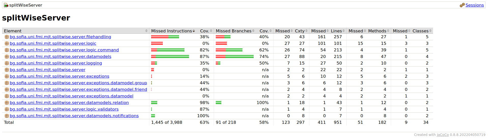

# Split-wise CLI app
## How to run it with Maven
First clone the repo.    
For the server open with a terminal the folder "splitWiseServer".   
To start the server, run the command .  
``` mvn exec:java ```  
To start the client, simply open the folder "splitWiseClient" with a terminal and run the command.   
``` mvn exec:java ```
## Documentation
### Introduction
The concept of the app is to be like the original Split-Wise but with a comand line interface and with less complex functionalities. After the server is started, clients can connect by booting up their client app.  
To see the full list of commands the user has to type "help". To be able to access all commands fully the user must be logged in his account. If he doesn't have one he can create one using the command "register".  
If you have used Splitwise before, all commands should seem intuitive.   
## Implementation  
The project compiles on Java 19. It uses recently added features like records and "arrow syntax" for the switch statement and others. 
The project uses well known object oriented programming patterns.  
It has a logger for unexpected behaviour and it also has a history logger which keeps track of all users' actions. The history logger is implemented so users can see the history of their transactions and repayments.  
Notifications are also added so users can recieve information about events that are related to them (ex. repayments, new splits, etc).  
The commands for the user interface are implemented with Enums and factory classes. After a user enters an input, the input is being proccessed by the CommandFactory class based on which pallete the given string matches. After that the result is being executed by the CommandExecutor class.  
The data base of the project is stored in a basic binary file.  
## Test coverage  
The test coverage was done with JaCoCo version 0.8.8  
 